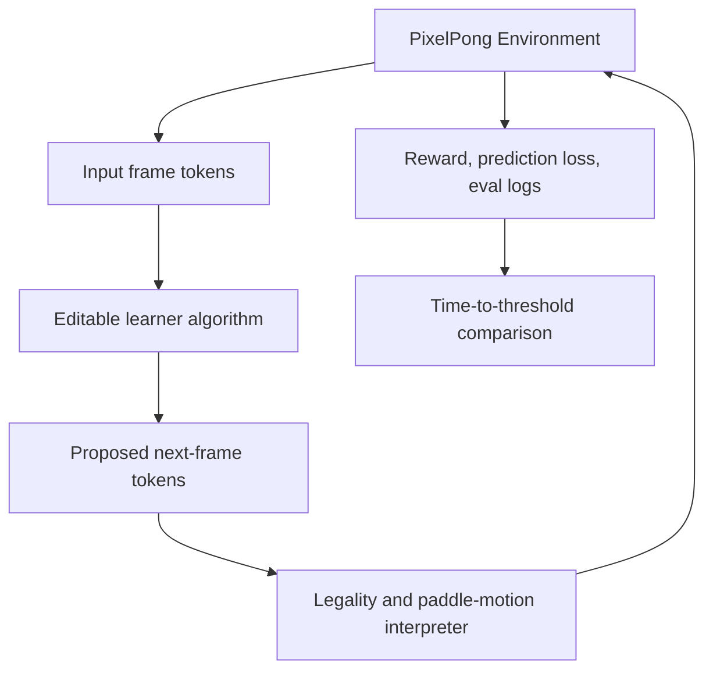
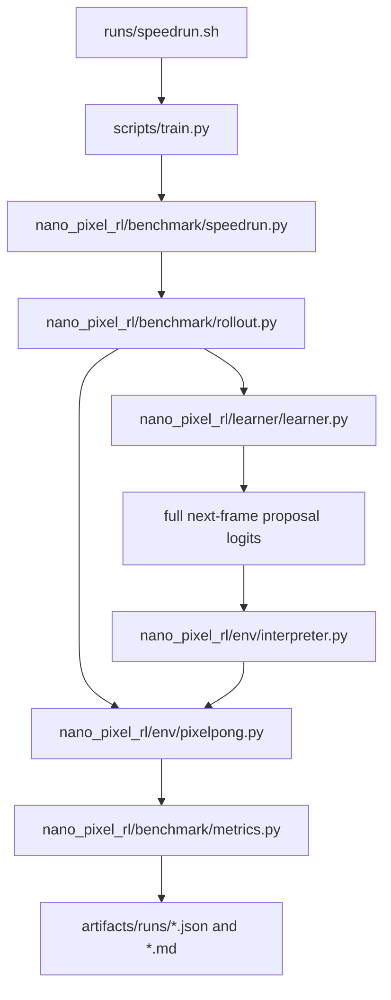

# Benchmark Architecture - Plan

## Goal Capsule

- **Objective:** Build the v1 Nano Pixel RL benchmark around PixelPong, including the frozen JAX environment, editable tiny-transformer learner, speedrun runner, docs, tests, and first signs-of-life training workflow.
- **Product authority:** `STRATEGY.md`, especially the speedrun benchmark, editable learner surface, immutable shared token space, and next-pixel prediction thesis.
- **Execution profile:** Implement on a feature branch, preserve the public repo's frozen benchmark contract, keep all contributor-facing algorithm changes inside `nano_pixel_rl/learner/`, and treat the remote Aesop Linux/CUDA machine as the authoritative test and training target after local CPU smoke checks.
- **Stop condition:** After implementation and review, run up to three complete uninterrupted two-hour scored-update training sessions on Aesop; stop early if the signs-of-life threshold is reached, and stop after the third failed complete session if it is not.
  Failed starts, setup failures, CUDA failures, crashes, or runs that do not produce a valid two-update-hour artifact do not count toward the three-session allotment.
- **Open blockers:** None for v1 implementation; later leaderboard thresholds remain calibration work after a working baseline exists.

---

## Product Contract

### Summary

Nano Pixel RL will be a benchmark-first repo for a PixelPong speedrun where contributors edit only the learner algorithm that transforms input frame tokens into proposed output frame tokens.
The environment, token vocabulary, legality rules, scoring, and leaderboard-valid run contract stay fixed so improvements measure learning dynamics rather than benchmark drift.

### Problem Frame

The project is trying to copy the useful part of nanochat's speedrun culture: a small, understandable repo where many contributors can make algorithmic changes and compare wall-clock progress against the same target.
For this to work in RL, the benchmark must prevent contributors from winning by changing the environment, action space, reward definition, data plumbing, or evaluation harness.
The shared token space is the core scaling bet: the model sees simple image-grid tokens and proposes the next image-grid tokens, making PixelPong a tiny version of the sequence-modeling problem rather than a discrete-action toy.

### Key Decisions

- **Benchmark-first repo:** The repo exists to run one canonical speedrun, not to provide a general RL framework.
- **Immutable token contract:** The token values and their meanings are fixed for leaderboard-valid runs: `0` is background, `0.5` is ball, and `1` is paddle.
- **Shared input/output token space:** Observations and proposals use the same grid vocabulary, so the learner's job is to transform input tokens into output tokens.
- **Algorithm-only competition surface:** Valid benchmark submissions may change learner internals, model architecture, loss weighting, optimization, memory, and update rules, but not the token vocabulary, environment rules, reward contract, or evaluator.
- **Next-pixel prediction is central:** Dense frame prediction loss is part of the benchmark thesis, not a debugging metric.
- **Learned tokenizer is a v2 suite bet:** Nanochat trains tokenization as part of the pipeline, but Nano Pixel RL v1 freezes tokenization; learned tokenization should wait until there is a suite of games where one shared tokenizer has to generalize.
- **Single reference script:** A `runs/speedrun.sh` equivalent should remain the canonical way to reproduce the current leaderboard run.
- **Single complexity dial:** The reference learner should expose one primary scale or budget dial whose downstream hyperparameters are derived, matching nanochat's bias against sprawling configuration.
- **Nanochat-style editable boundary:** Contributor-facing model and update logic should be concentrated in a compact learner surface analogous to nanochat's direct script/module editing style, not hidden behind a framework.
- **Tiny transformer baseline:** The first reference learner should be a tiny transformer-style sequence model over frame tokens, preserving the nanochat analogy even if simpler baselines are useful for debugging.
- **JAX-first runtime:** The environment transition, opponent heuristic, proposal interpreter, rollout batching, learner update, evaluation, and metric aggregation should be JAX-native so the benchmark can use `jit` and `vmap` end to end.
- **Linux CUDA target:** GPU acceleration for the GTX 1660 Ti-class local target should assume native Linux CUDA first, with WSL2 as the secondary path for Windows-hosted machines and native Windows treated as CPU-only for JAX smoke tests.



### Actors

- A1. **Benchmark contributor:** Edits the learner algorithm and runs the canonical speedrun to reduce time-to-threshold.
- A2. **Benchmark maintainer:** Protects the environment contract, threshold, leaderboard rules, and reference run quality.
- A3. **Future planner or agent:** Reads this plan to produce an implementation plan without inventing benchmark behavior.

### Requirements

**Benchmark contract**

- R1. The repo must define one canonical PixelPong benchmark with stable environment rules, reward components, evaluation rollouts, and leaderboard-valid run output.
- R2. The shared token vocabulary must be immutable for leaderboard-valid runs: `0` means background, `0.5` means ball, and `1` means paddle.
- R3. The observation and action proposal must use the same grid token space, with the learner proposing an entire next frame rather than a discrete UP/DOWN action.
- R4. The environment must interpret coherent paddle movement from the proposed frame and reject impossible edits without allowing the learner to bypass physics through direct state edits.
- R5. The reward contract must include a large point-winning signal and a smaller dense next-pixel prediction signal.
- R6. The benchmark must separate controllable and uncontrollable dynamics: one paddle is influenceable through legal proposals, the ball follows physics, and the opponent paddle is not directly controlled by the learner.
- R7. The v1 benchmark must not include learned tokenization or alternate token vocabularies, even though the docs should name this as a likely future direction for a multi-game suite.
- R8. V1 must include an opponent ladder with at least random/legal, delayed tracker, and near-perfect tracker opponents.

**Runtime contract**

- R9. The hot benchmark path must be written in JAX: environment step, heuristic opponent, proposal interpreter, batched rollouts, learner update, evaluation, and metric aggregation.
- R10. The hot path must support vectorized execution over many environments using JAX transformations rather than Python loops.
- R11. Non-JAX Python code may handle CLI, reports, docs, file IO, and orchestration, but it must not sit inside the per-step training or evaluation loop.
- R12. The repo should use JAX-native RL libraries as design references for environment/state interfaces and batching patterns, but v1 should not depend on a large external RL framework unless it removes more complexity than it adds.
- R13. The documented accelerated local path should target native Linux with CUDA first; WSL2 CUDA can be documented as a secondary path, and native Windows should be supported only for CPU smoke tests unless JAX GPU support changes.

**Contributor surface**

- R14. The repo must make the intended editable surface obvious: contributors change learner algorithm code that maps input tokens to output tokens.
- R15. The repo must document which surfaces are frozen for leaderboard-valid work, including token vocabulary, environment transition rules, legality checks, reward definitions, evaluator, and speedrun command semantics.
- R16. The learner surface must support algorithm-level experimentation, including model shape, optimizer, memory/state, auxiliary losses, batching, and update logic.
- R17. The learner surface must not require contributors to understand or modify backend environment plumbing for normal experimentation.
- R18. The initial reference learner should be a tiny transformer-style sequence model over the immutable frame tokens.

**Speedrun and leaderboard**

- R19. The repo must provide a canonical speedrun command that trains, evaluates, records training-update time, and emits a submission-ready result artifact.
- R20. The leaderboard metric must be time-to-threshold, where the threshold is based on PixelPong point performance and valid run checks rather than prediction loss alone.
- R21. The scored-time convention for v1 must count only learner training/update time, excluding setup, evaluation, and report generation.
- R22. Run artifacts must include enough metadata to audit validity, including code revision, seed settings, hardware summary, training-update time, threshold result, invalid proposal rate, and prediction loss.
- R23. The canonical run should generate a human-readable report and a machine-readable result artifact, with the report convenient to inspect from the repo root after the run.
- R24. The v1 reference run should initially target signs of life within roughly 10 hours on modest local hardware such as a GTX 1660 Ti, with the expectation that contributors optimize it toward faster and stronger thresholds over time.
- R25. The v1 signs-of-life target is at least a 90% win rate versus the random/legal opponent and at least a 50% win rate versus the delayed-tracker opponent on fixed evaluation seeds.

**Repo shape**

- R26. The repo should separate frozen benchmark code from editable learner code in names and documentation, so contributors can tell what is fair game.
- R27. The repo should include a small reference learner that is simple enough to modify and slow enough to leave room for speedrun improvements.
- R28. The repo should prefer a compact nanochat-like shape: package code, scripts, runs, tests, docs, `pyproject.toml`, and a lockfile.
- R29. The README should carry the public leaderboard and shortest path to the canonical speedrun, while detailed contribution rules can live in a deeper leaderboard doc.
- R30. The repo should include docs that explain the shared-token thesis, leaderboard rules, validity rules, the v2 learned-tokenizer direction, and the shortest path from clone to first speedrun.
- R31. The repo should include tests or validation checks that catch accidental changes to token meanings, environment dynamics, reward shape, evaluator behavior, and JAX vectorization assumptions.

### Proposed Repo Design

The exact file names may change during planning, but the repo should preserve this separation of responsibilities.

```text
nano-pixel-rl/
  README.md
  STRATEGY.md
  pyproject.toml
  uv.lock
  docs/
    benchmark-contract.md
    learner-guide.md
    plans/
  dev/
    LEADERBOARD.md
    LOG.md
  nano_pixel_rl/
    env/
      pixelpong.py
      tokens.py
      interpreter.py
      opponent.py
      rewards.py
    benchmark/
      speedrun.py
      evaluate.py
      validate_run.py
      logging.py
    learner/
      learner.py
      model.py
      update.py
    reference/
      config.py
      baseline.py
  runs/
    speedrun.sh
    smoke.sh
  scripts/
    train.py
    eval.py
    report.py
  tests/
    test_tokens.py
    test_pixelpong_dynamics.py
    test_interpreter_legality.py
    test_reward_contract.py
    test_run_validation.py
```

### Key Flows

- F1. **First local speedrun**
  - **Trigger:** A contributor clones the repo and wants a baseline result.
  - **Actors:** A1.
  - **Steps:** Install dependencies, run the canonical speedrun command, train the reference learner, evaluate against the threshold, and inspect the emitted run artifact.
  - **Outcome:** The contributor has a valid baseline time and knows where to edit learner logic.

- F2. **Learner experiment loop**
  - **Trigger:** A contributor wants to improve benchmark speed.
  - **Actors:** A1.
  - **Steps:** Edit learner algorithm code, run a smoke check, run the speedrun, compare time-to-threshold and validity metrics against the baseline.
  - **Outcome:** The contributor can tell whether the algorithm improved speed without changing the benchmark contract.

- F3. **Maintainer validity review**
  - **Trigger:** A result is proposed for the leaderboard.
  - **Actors:** A2.
  - **Steps:** Check run artifact metadata, confirm frozen surfaces were not changed, verify threshold was reached, and compare reported metrics.
  - **Outcome:** The maintainer can accept or reject the run without reverse-engineering the experiment.

### Acceptance Examples

- AE1. **Covers R2, R3, R15.**
  - **Given:** A contributor changes the meaning of token `0.5` from ball to something else.
  - **When:** The run is validated for leaderboard eligibility.
  - **Then:** The run is rejected because the token vocabulary is immutable.

- AE2. **Covers R4, R6.**
  - **Given:** The learner proposes a frame that teleports the ball or directly edits the opponent paddle.
  - **When:** The environment interpreter processes the proposal.
  - **Then:** The impossible edit is rejected or ignored according to the fixed legality contract.

- AE3. **Covers R5, R20.**
  - **Given:** A learner achieves low next-pixel prediction loss but cannot win points.
  - **When:** The speedrun evaluates threshold completion.
  - **Then:** The run does not qualify because point performance is the main threshold signal.

- AE4. **Covers R14, R16, R17.**
  - **Given:** A contributor changes model architecture and update logic inside the learner surface.
  - **When:** The speedrun validates the run.
  - **Then:** The run remains eligible if frozen benchmark surfaces are unchanged.

- AE5. **Covers R9, R10, R11.**
  - **Given:** A training run batches many PixelPong environments.
  - **When:** The benchmark executes rollout and update steps.
  - **Then:** The per-step loop stays inside JAX-transformed code rather than iterating environment steps in Python.

- AE6. **Covers R8, R25.**
  - **Given:** A trained learner is evaluated on fixed seeds against the random/legal and delayed-tracker opponents.
  - **When:** The v1 signs-of-life check runs.
  - **Then:** The run passes only if it reaches at least 90% win rate versus random/legal and at least 50% win rate versus delayed tracker.

### Success Criteria

- The first implementation plan can proceed without inventing the environment/learner boundary.
- The implementation plan can proceed without inventing the runtime stack: JAX owns the hot benchmark path.
- A new contributor can identify the editable learner surface in under five minutes from the README.
- A speedrun result can be audited from its emitted artifact without reading the whole codebase.
- Tests or validators fail when token meanings, reward components, evaluator semantics, or legality rules change unexpectedly.
- The canonical run feels nanochat-like: one obvious script, one obvious report, and one primary scale or budget dial.
- The first benchmark milestone is concrete: 90% win rate versus random/legal and 50% win rate versus delayed tracker.
- The reference run can show measurable learning on modest local hardware before the project tightens into a stricter leaderboard threshold.

### Scope Boundaries

**Deferred for later**

- Multiple environments beyond PixelPong.
- Learned tokenization; this should be revisited when the benchmark becomes a suite of games with one shared tokenizer and one shared model.
- A polished web dashboard for leaderboard browsing.
- Rich visualization tools beyond minimal debugging output.
- Distributed training support.
- A broad configuration system with many first-class benchmark knobs.
- Native Windows GPU support as a v1 requirement.

**Outside this product's identity**

- A general Gym-compatible RL framework as the main interface.
- Leaderboard-valid submissions that alter token meanings, environment physics, reward definitions, or evaluator thresholds.
- PixelPong-only learned tokenizers that win by compressing one environment's representation instead of improving cross-environment learning.
- Discrete action-head competition as the core benchmark shape.

### Dependencies / Assumptions

- Python is the default implementation language unless planning finds a strong reason to choose otherwise.
- JAX is the default accelerated runtime for v1; NumPy/Python fallbacks are acceptable only for tests, reports, or debugging helpers.
- The target GTX 1660 Ti machine is Linux, so the primary accelerated setup is native Linux CUDA with JAX.
- The v1 signs-of-life metric is fixed at 90% win rate versus random/legal and 50% win rate versus delayed tracker; later leaderboard thresholds can be calibrated after a working reference learner exists.
- The rough 10-hour GTX 1660 Ti target is a v1 accessibility goal, not yet an empirical measurement.
- Leaderboard validity depends on social rules and repository checks; v1 does not need tamper-proof remote attestation.

### Outstanding Questions

**Deferred to planning**

- What initial grid size, paddle size, and episode length should v1 use?
- Whether the canonical command should be shell-first, Python CLI-first, or both.
- Whether run artifacts should be JSON only or include a small markdown summary.
- How strict validation should be for changes outside the learner surface in non-leaderboard local experiments.
- Which JAX-native library patterns to copy first: gymnax-style env API, Jumanji-style typed state/specs, or a minimal local interface inspired by both.

### Sources / Research

- `STRATEGY.md` defines the product thesis, primary users, metrics, and active tracks.
- `karpathy/nanochat` comparison notes: README places the Time-to-GPT-2 leaderboard upfront, `runs/speedrun.sh` is the canonical reproduction script, `dev/LEADERBOARD.md` documents contribution rules, and the codebase uses uv plus a compact package/scripts/runs/tests shape.
- JAX official installation docs: NVIDIA GPU support is available on Linux/WSL2 paths, while native Windows GPU is not a supported target.
- JAX-native RL library references: gymnax for `jit`/`vmap` environment API patterns, Jumanji for scalable JAX environment-suite patterns, and Brax/Pgx for accelerator-oriented simulation examples.

---

## Planning Contract

### Key Technical Decisions

- KTD1. **Fixed v1 PixelPong geometry:** Use a `16x16` grid, a single-cell ball, vertical paddles of height `3`, the learner-controlled paddle at `x=1`, and the opponent paddle at `x=14`.
  This is large enough for visible dynamics and small enough for cheap sequence modeling on a GTX 1660 Ti-class machine.
- KTD2. **Integer internal tokens with float public meanings:** Store frame tokens internally as `uint8` IDs `0`, `1`, and `2`, while docs and reports map them to public values `0`, `0.5`, and `1`.
  This preserves the immutable token contract while keeping JAX losses and indexing simple.
- KTD3. **Proposal-as-action interpreter:** Convert a proposed next frame into one of three legal paddle deltas by reading only the controlled paddle column and rejecting incoherent paddle edits.
  The proposal may predict ball and opponent pixels for dense loss, but those pixels never directly mutate environment state.
- KTD4. **Physics owns the ball and opponent:** The JAX environment updates ball position, wall bounces, paddle collisions, scores, episode resets, and opponent movement from state, not from learner-proposed pixels.
  This enforces the predictable-versus-controllable split that defines the benchmark.
- KTD5. **Tiny transformer as the editable learner:** Implement the baseline as a compact JAX/Optax transformer-style next-frame predictor with a single `learner.update()` entry point and one main scale dial.
  The reference should be understandable enough to edit while leaving room for algorithmic improvements.
- KTD6. **Training-time accounting wraps update work only:** The speedrun runner measures learner update wall-clock time around train/update calls and excludes dependency setup, evaluation, report writing, and validation.
  This matches the user's scoring convention and keeps early benchmarking honest.
- KTD7. **Validation is social plus automated checks:** V1 should not attempt tamper-proof attestation.
  It should emit enough metadata and run enough contract tests to make frozen-surface changes obvious during review.

### High-Level Technical Design



The hot loop is JAX-native: batched reset, batched rollout, proposal interpretation, environment step, loss computation, optimizer update, and metric aggregation all sit behind `jax.jit` and `jax.vmap` where practical.
Python owns CLI parsing, artifact paths, markdown reports, and long-run orchestration.

### Implementation Assumptions

- The repo uses `uv`, `pyproject.toml`, and a compact package layout modeled after nanochat.
- Required runtime dependencies are `jax`, `jaxlib`, `optax`, and `numpy`; optional accelerator install instructions live in docs rather than in platform-specific lockfile magic.
- V1 prioritizes a correct editable benchmark over a highly tuned model.
- Native Windows may run CPU smoke tests, but most validation and all long training runs happen on the remote Aesop Linux/CUDA machine.

### Sequencing

1. Build repo scaffolding, dependency metadata, README, and frozen-surface docs.
2. Implement and test the JAX token, environment, opponent, interpreter, reward, rollout, and validation contracts.
3. Implement and test the tiny transformer learner and update timing surface.
4. Add speedrun CLI, run artifacts, leaderboard docs, and smoke scripts.
5. Run contract tests, simplify, review, fix review findings, then start five-hour training sessions.

### Risks and Mitigations

| Risk | Mitigation |
|---|---|
| The tiny transformer does not reach signs of life in the first three sessions. | Preserve artifacts for each complete session, report metrics, and stop after the requested third failed uninterrupted run. |
| Python loops leak into the hot path. | Add tests that inspect batched JAX functions and keep rollout/update APIs array-first. |
| The learner exploits the proposal surface by editing non-controlled pixels. | Keep interpreter authority narrow: only coherent controlled-paddle movement becomes action. |
| The immutable token contract drifts during iteration. | Centralize token constants and add contract tests for public meanings, frame encoding, and docs references. |
| Training accounting becomes misleading. | Isolate update-time timers in the speedrun runner and include raw setup/eval/report timings only as unscored metadata. |

### Deferred Implementation-Time Unknowns

- The first working learner may need dense-loss weighting, entropy/legality penalties, batch size, or context length tuning to show learning; these are editable learner-surface decisions, not benchmark-contract changes.
- The exact five-hour command may vary between local Windows smoke and Linux CUDA training; the canonical script should expose duration and device visibility without changing scored semantics.

---

## Implementation Units

### U1. Repo Scaffold and Contributor Contract

- **Goal:** Create the nanochat-like repo shape, dependency metadata, README, leaderboard docs, and frozen/editable surface documentation.
- **Requirements:** R1, R7, R14, R15, R19, R23, R26, R28, R29, R30.
- **Files:** Create `README.md`, `pyproject.toml`, `dev/LEADERBOARD.md`, `dev/LOG.md`, `docs/benchmark-contract.md`, `docs/learner-guide.md`, `runs/smoke.sh`, and package `__init__.py` files.
- **Approach:** Document the immutable token space, shared input/output proposal thesis, speedrun target, scored-time convention, Linux CUDA preference, and contributor rule that learner code is the normal editable surface.
- **Patterns:** Follow `STRATEGY.md` language and the existing `docs/plans/` contract vocabulary.
- **Test Scenarios:** `README.md` names the speedrun command; docs list frozen and editable surfaces; `pyproject.toml` exposes package metadata and test dependencies.
- **Verification:** `uv run python -m pytest tests/test_docs_contract.py` passes after docs contract tests exist.

### U2. JAX PixelPong Environment and Tokens

- **Goal:** Implement the frozen PixelPong state, token constants, frame encoder, physics step, reset, scoring, and opponent ladder in JAX.
- **Requirements:** R1, R2, R6, R8, R9, R10, R11, R13, R31.
- **Files:** Create `nano_pixel_rl/env/tokens.py`, `nano_pixel_rl/env/pixelpong.py`, `nano_pixel_rl/env/opponent.py`, `nano_pixel_rl/env/rewards.py`, and tests under `tests/test_tokens.py`, `tests/test_pixelpong_dynamics.py`, `tests/test_opponents.py`, `tests/test_reward_contract.py`.
- **Approach:** Use dataclass-like JAX pytrees for environment state, expose `reset(key, config)`, `step(state, action, opponent_kind, key, config)`, and `render_frame(state, config)`, then vectorize with `jax.vmap` in tests.
- **Patterns:** Copy gymnax-style functional reset/step shape without taking a framework dependency.
- **Test Scenarios:** Fixed seeds produce legal frames; wall bounces invert vertical velocity; paddle collisions invert horizontal velocity; misses award points and reset ball; random/legal, delayed, and near-perfect opponents emit legal deltas; `vmap` over multiple states returns stacked frames and metrics.
- **Verification:** `uv run python -m pytest tests/test_tokens.py tests/test_pixelpong_dynamics.py tests/test_opponents.py tests/test_reward_contract.py` passes.

### U3. Proposal Interpreter and Dense Prediction Metrics

- **Goal:** Convert full-frame learner proposals into coherent paddle actions while computing validity and next-frame prediction metrics.
- **Requirements:** R3, R4, R5, R6, R9, R10, R15, R21, R22, R31.
- **Files:** Create `nano_pixel_rl/env/interpreter.py`, `nano_pixel_rl/benchmark/metrics.py`, `tests/test_interpreter_legality.py`, and `tests/test_metrics.py`.
- **Approach:** Read the controlled paddle column from the proposal, accept only one contiguous paddle of the configured height within one-cell movement from the current paddle, demote illegal proposals to no-op, and compute invalid proposal rate plus token-level cross-entropy/accuracy against the actual next frame.
- **Patterns:** Keep interpreter functions pure and array-first so rollout can `jit` and `vmap` them.
- **Test Scenarios:** Legal up/down/no-op proposals map to the right deltas; teleported paddles are rejected; disconnected or wrong-height paddles are rejected; proposed ball/opponent edits do not change physics; metric aggregation reports invalid proposal rate and prediction loss.
- **Verification:** `uv run python -m pytest tests/test_interpreter_legality.py tests/test_metrics.py` passes.

### U4. Editable Tiny Transformer Learner

- **Goal:** Implement the reference learner with a compact `learner.update()` API that maps frame-token histories to next-frame proposal logits.
- **Requirements:** R14, R16, R17, R18, R21, R24, R27.
- **Files:** Create `nano_pixel_rl/learner/model.py`, `nano_pixel_rl/learner/learner.py`, `nano_pixel_rl/learner/update.py`, `nano_pixel_rl/reference/config.py`, and tests under `tests/test_learner_update.py`.
- **Approach:** Use JAX arrays and Optax to build token embeddings, positional embeddings, a small causal/self-attention block, MLP head, optimizer state, and `update(state, batch, key)` returning the next learner state plus scalar metrics.
- **Patterns:** Keep all algorithmic experimentation in `nano_pixel_rl/learner/`; keep config small with one primary scale dial such as `model_size`.
- **Test Scenarios:** Initialization is deterministic by seed; forward logits have shape `[batch, height, width, vocab]`; one update changes parameters and returns finite losses; learner code can be imported without initializing the environment backend.
- **Verification:** `uv run python -m pytest tests/test_learner_update.py` passes.

### U5. Batched Rollout and Training Loop

- **Goal:** Wire environment, interpreter, learner, rewards, and metrics into a JAX-first batched training loop.
- **Requirements:** R1, R5, R6, R8, R9, R10, R11, R16, R19, R20, R21, R24, R25.
- **Files:** Create `nano_pixel_rl/benchmark/rollout.py`, `nano_pixel_rl/benchmark/speedrun.py`, `scripts/train.py`, `scripts/eval.py`, and tests under `tests/test_rollout_training.py`.
- **Approach:** Run many environments in parallel, collect learner proposals, interpret actions, step the environment, compute dense frame loss and point rewards, call `learner.update()`, and accumulate scored update time separately from eval/report time.
- **Patterns:** Keep Python orchestration outside the per-step body; use `jax.jit` on rollout/update kernels and expose small smoke-friendly defaults.
- **Test Scenarios:** A smoke train run completes on CPU; scored update time is positive and excludes eval/report phases; eval reports win rates against random/legal and delayed opponents; fixed eval seeds make repeated short evals stable.
- **Verification:** `uv run python -m pytest tests/test_rollout_training.py` passes, and `uv run python scripts/train.py --steps 2 --num-envs 8 --eval-episodes 8 --out artifacts/smoke` writes artifacts.

### U6. Speedrun Artifacts, Validation, and Leaderboard Rules

- **Goal:** Produce submission-ready run artifacts, validate frozen-surface semantics, and provide canonical run scripts.
- **Requirements:** R19, R20, R21, R22, R23, R25, R29, R30, R31.
- **Files:** Create `nano_pixel_rl/benchmark/validate_run.py`, `nano_pixel_rl/benchmark/logging.py`, `scripts/report.py`, `runs/speedrun.sh`, and tests under `tests/test_run_validation.py`.
- **Approach:** Emit JSON plus markdown summaries containing git revision, seeds, hardware summary, update time, threshold status, win rates, invalid proposal rate, prediction loss, config, and leaderboard validity checks.
- **Patterns:** Mirror nanochat's canonical `runs/speedrun.sh` convention and keep detailed leaderboard rules in `dev/LEADERBOARD.md`.
- **Test Scenarios:** Valid smoke artifact passes validation; missing metadata fails; threshold status requires both win-rate gates; prediction loss alone cannot mark a run valid; `runs/speedrun.sh --help` or equivalent explains duration and output path.
- **Verification:** `uv run python -m pytest tests/test_run_validation.py` passes, and `bash runs/smoke.sh` completes on a CPU-capable environment.

### U7. Quality Pass and Signs-of-Life Training Sessions

- **Goal:** Review, simplify, and run the first two-update-hour training sessions under the requested stop condition.
- **Requirements:** R19, R20, R21, R22, R24, R25, R31.
- **Files:** Modify code from U1-U6 as review findings require; write artifacts under `artifacts/runs/` and notes in `dev/LOG.md`.
- **Approach:** Run the full test suite, run `ce-simplify-code` on the changed implementation, run `ce-code-review`, apply actionable fixes, then run up to three complete uninterrupted five-hour training sessions until the signs-of-life gates pass or the third complete session fails.
- **Patterns:** Do not change frozen benchmark surfaces to make the learner pass; tune only learner/config surfaces allowed by the contributor contract.
- **Test Scenarios:** Full tests pass before long runs; each complete two-update-hour session writes JSON and markdown artifacts; reaching 90% versus random/legal and 50% versus delayed tracker stops the run loop; three complete failed sessions stop the goal and preserve artifacts; failed starts and invalid artifacts are logged but do not count toward the three-session allotment.
- **Verification:** `uv run pytest` passes, review has no unresolved blocking findings, and training artifacts prove either signs of life or the requested three-session stop condition.

---

## Verification Contract

| Gate | Command or Evidence | Covers |
|---|---|---|
| Static import smoke | `uv run python -c "import nano_pixel_rl; print(nano_pixel_rl.__version__)"` | U1, U4 |
| Unit and contract tests | `uv run pytest` | U1-U6 |
| CPU smoke speedrun | `bash runs/smoke.sh` | U2-U6 |
| Artifact validation | `uv run python scripts/report.py --validate <run-json>` | U6, U7 |
| Review pass | `ce-code-review mode:agent plan:docs/plans/2026-06-30-001-feat-benchmark-architecture-plan.md base:origin/main` or equivalent review output | U7 |
| Simplification pass | `ce-simplify-code` on the current branch diff with tests rerun | U7 |
| Remote Linux/CUDA validation | Sync branch to Aesop, install with `uv`, run `uv run --extra dev pytest`, and run `bash runs/smoke.sh` | U1-U7 |
| Signs-of-life sessions | Up to three complete two-update-hour `runs/speedrun.sh` sessions on Aesop with valid run artifacts; failed starts do not count | U7 |

The signs-of-life gate passes only when evaluation reaches at least `90%` win rate versus random/legal and at least `50%` win rate versus delayed tracker on fixed evaluation seeds.
Prediction loss, invalid proposal rate, and update time are required diagnostics but cannot replace the win-rate threshold.

---

## Definition of Done

- The repo has a package, docs, scripts, tests, and run artifacts matching the nanochat-like public benchmark shape.
- The immutable token contract is centralized, documented, and covered by tests.
- The JAX environment, interpreter, opponent ladder, reward contract, rollout, evaluation, and metrics run in batched form.
- The editable learner surface exposes a tiny transformer-style `learner.update()` path and keeps normal algorithm changes out of frozen benchmark code.
- The canonical smoke command runs locally and writes valid JSON and markdown artifacts.
- The canonical speedrun command can run two-update-hour sessions on Aesop and measure only learner training/update time for the leaderboard score.
- Full tests pass after simplification and review fixes.
- Long-run artifacts prove either the signs-of-life threshold was reached or three complete uninterrupted two-update-hour sessions failed to reach it; failed starts are excluded from the count and documented separately.
- Dead-end experimental code, abandoned scripts, and untracked generated files are removed or ignored before final handoff.
