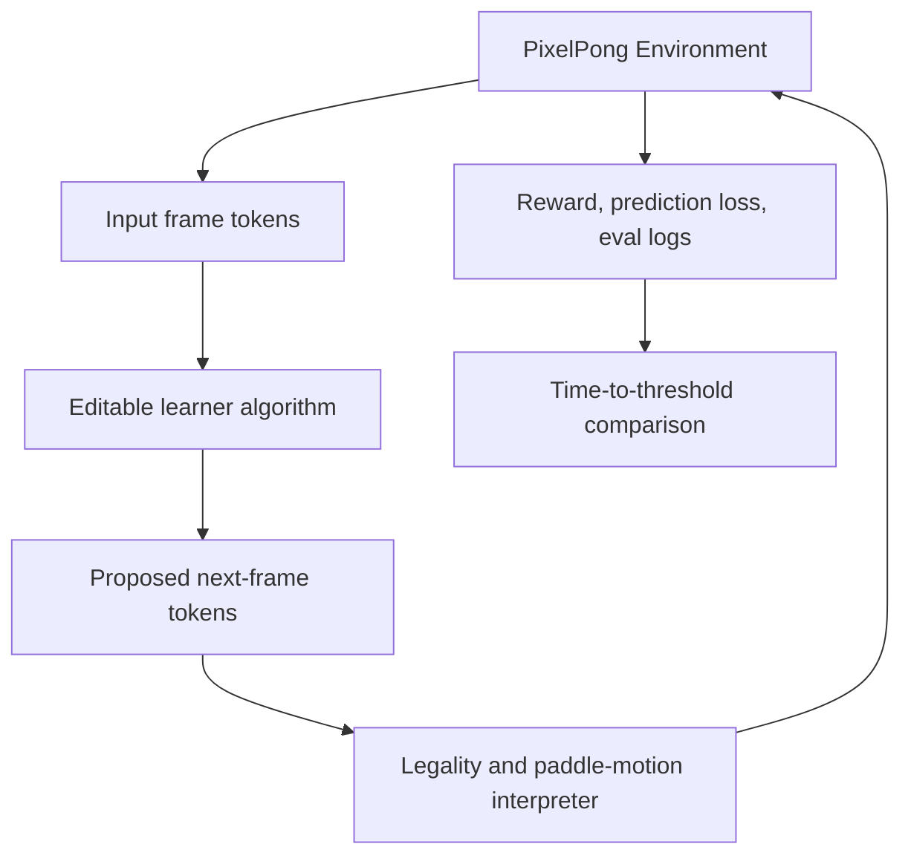

# Benchmark Architecture - Plan

## Goal Capsule

- **Objective:** Define the v1 architecture requirements for Nano Pixel RL before implementation begins.
- **Product authority:** `STRATEGY.md`, especially the speedrun benchmark, editable learner surface, immutable shared token space, and next-pixel prediction thesis.
- **Open blockers:** The exact grid dimensions, signs-of-life metric, later leaderboard threshold, and initial baseline runtime must be calibrated during implementation.

---

## Product Contract

### Summary

Nano Pixel RL will be a benchmark-first repo for a PixelPong speedrun where contributors edit only the learner algorithm that transforms input frame tokens into proposed output frame tokens.
The environment, token vocabulary, legality rules, scoring, and leaderboard-valid run contract stay fixed so improvements measure learning dynamics rather than benchmark drift.

### Problem Frame

The project is trying to copy the useful part of nanochat's speedrun culture: a small, understandable repo where many contributors can make algorithmic changes and compare wall-clock progress against the same target.
For this to work in RL, the benchmark must prevent contributors from winning by changing the environment, action space, reward definition, data plumbing, or evaluation harness.
The shared token space is the core scaling bet: the model sees simple image-grid tokens and proposes the next image-grid tokens, making PixelPong a tiny version of the sequence-modeling problem rather than a discrete-action toy.

### Key Decisions

- **Benchmark-first repo:** The repo exists to run one canonical speedrun, not to provide a general RL framework.
- **Immutable token contract:** The token values and their meanings are fixed for leaderboard-valid runs: `0` is background, `0.5` is ball, and `1` is paddle.
- **Shared input/output token space:** Observations and proposals use the same grid vocabulary, so the learner's job is to transform input tokens into output tokens.
- **Algorithm-only competition surface:** Valid benchmark submissions may change learner internals, model architecture, loss weighting, optimization, memory, and update rules, but not the token vocabulary, environment rules, reward contract, or evaluator.
- **Next-pixel prediction is central:** Dense frame prediction loss is part of the benchmark thesis, not a debugging metric.
- **Learned tokenizer is a v2 suite bet:** Nanochat trains tokenization as part of the pipeline, but Nano Pixel RL v1 freezes tokenization; learned tokenization should wait until there is a suite of games where one shared tokenizer has to generalize.
- **Single reference script:** A `runs/speedrun.sh` equivalent should remain the canonical way to reproduce the current leaderboard run.
- **Single complexity dial:** The reference learner should expose one primary scale or budget dial whose downstream hyperparameters are derived, matching nanochat's bias against sprawling configuration.
- **JAX-first runtime:** The environment transition, opponent heuristic, proposal interpreter, rollout batching, learner update, evaluation, and metric aggregation should be JAX-native so the benchmark can use `jit` and `vmap` end to end.
- **Linux CUDA target:** GPU acceleration for the GTX 1660 Ti-class local target should assume native Linux CUDA first, with WSL2 as the secondary path for Windows-hosted machines and native Windows treated as CPU-only for JAX smoke tests.



### Actors

- A1. **Benchmark contributor:** Edits the learner algorithm and runs the canonical speedrun to reduce time-to-threshold.
- A2. **Benchmark maintainer:** Protects the environment contract, threshold, leaderboard rules, and reference run quality.
- A3. **Future planner or agent:** Reads this plan to produce an implementation plan without inventing benchmark behavior.

### Requirements

**Benchmark contract**

- R1. The repo must define one canonical PixelPong benchmark with stable environment rules, reward components, evaluation rollouts, and leaderboard-valid run output.
- R2. The shared token vocabulary must be immutable for leaderboard-valid runs: `0` means background, `0.5` means ball, and `1` means paddle.
- R3. The observation and action proposal must use the same grid token space, with the learner proposing an entire next frame rather than a discrete UP/DOWN action.
- R4. The environment must interpret coherent paddle movement from the proposed frame and reject impossible edits without allowing the learner to bypass physics through direct state edits.
- R5. The reward contract must include a large point-winning signal and a smaller dense next-pixel prediction signal.
- R6. The benchmark must separate controllable and uncontrollable dynamics: one paddle is influenceable through legal proposals, the ball follows physics, and the opponent paddle is not directly controlled by the learner.
- R7. The v1 benchmark must not include learned tokenization or alternate token vocabularies, even though the docs should name this as a likely future direction for a multi-game suite.

**Runtime contract**

- R8. The hot benchmark path must be written in JAX: environment step, heuristic opponent, proposal interpreter, batched rollouts, learner update, evaluation, and metric aggregation.
- R9. The hot path must support vectorized execution over many environments using JAX transformations rather than Python loops.
- R10. Non-JAX Python code may handle CLI, reports, docs, file IO, and orchestration, but it must not sit inside the per-step training or evaluation loop.
- R11. The repo should use JAX-native RL libraries as design references for environment/state interfaces and batching patterns, but v1 should not depend on a large external RL framework unless it removes more complexity than it adds.
- R12. The documented accelerated local path should target native Linux with CUDA first; WSL2 CUDA can be documented as a secondary path, and native Windows should be supported only for CPU smoke tests unless JAX GPU support changes.

**Contributor surface**

- R13. The repo must make the intended editable surface obvious: contributors change learner algorithm code that maps input tokens to output tokens.
- R14. The repo must document which surfaces are frozen for leaderboard-valid work, including token vocabulary, environment transition rules, legality checks, reward definitions, evaluator, and speedrun command semantics.
- R15. The learner surface must support algorithm-level experimentation, including model shape, optimizer, memory/state, auxiliary losses, batching, and update logic.
- R16. The learner surface must not require contributors to understand or modify backend environment plumbing for normal experimentation.

**Speedrun and leaderboard**

- R17. The repo must provide a canonical speedrun command that trains, evaluates, records wall-clock time, and emits a submission-ready result artifact.
- R18. The leaderboard metric must be time-to-threshold, where the threshold is based on PixelPong point performance and valid run checks rather than prediction loss alone.
- R19. The repo must define the scored-time convention clearly, including whether setup, evaluation, reporting, and failed threshold probes are included or excluded.
- R20. Run artifacts must include enough metadata to audit validity, including code revision, seed settings, hardware summary, elapsed time, threshold result, invalid proposal rate, and prediction loss.
- R21. The canonical run should generate a human-readable report and a machine-readable result artifact, with the report convenient to inspect from the repo root after the run.
- R22. The v1 reference run should initially target signs of life within roughly 10 hours on modest local hardware such as a GTX 1660 Ti, with the expectation that contributors optimize it toward faster and stronger thresholds over time.

**Repo shape**

- R23. The repo should separate frozen benchmark code from editable learner code in names and documentation, so contributors can tell what is fair game.
- R24. The repo should include a small reference learner that is simple enough to modify and slow enough to leave room for speedrun improvements.
- R25. The repo should prefer a compact nanochat-like shape: package code, scripts, runs, tests, docs, `pyproject.toml`, and a lockfile.
- R26. The README should carry the public leaderboard and shortest path to the canonical speedrun, while detailed contribution rules can live in a deeper leaderboard doc.
- R27. The repo should include docs that explain the shared-token thesis, leaderboard rules, validity rules, the v2 learned-tokenizer direction, and the shortest path from clone to first speedrun.
- R28. The repo should include tests or validation checks that catch accidental changes to token meanings, environment dynamics, reward shape, evaluator behavior, and JAX vectorization assumptions.

### Proposed Repo Design

The exact file names may change during planning, but the repo should preserve this separation of responsibilities.

```text
nano-pixel-rl/
  README.md
  STRATEGY.md
  pyproject.toml
  uv.lock
  docs/
    benchmark-contract.md
    learner-guide.md
    plans/
  dev/
    LEADERBOARD.md
    LOG.md
  nano_pixel_rl/
    env/
      pixelpong.py
      tokens.py
      interpreter.py
      opponent.py
      rewards.py
    benchmark/
      speedrun.py
      evaluate.py
      validate_run.py
      logging.py
    learner/
      learner.py
      model.py
      update.py
    reference/
      config.py
      baseline.py
  runs/
    speedrun.sh
    smoke.sh
  scripts/
    train.py
    eval.py
    report.py
  tests/
    test_tokens.py
    test_pixelpong_dynamics.py
    test_interpreter_legality.py
    test_reward_contract.py
    test_run_validation.py
```

### Key Flows

- F1. **First local speedrun**
  - **Trigger:** A contributor clones the repo and wants a baseline result.
  - **Actors:** A1.
  - **Steps:** Install dependencies, run the canonical speedrun command, train the reference learner, evaluate against the threshold, and inspect the emitted run artifact.
  - **Outcome:** The contributor has a valid baseline time and knows where to edit learner logic.

- F2. **Learner experiment loop**
  - **Trigger:** A contributor wants to improve benchmark speed.
  - **Actors:** A1.
  - **Steps:** Edit learner algorithm code, run a smoke check, run the speedrun, compare time-to-threshold and validity metrics against the baseline.
  - **Outcome:** The contributor can tell whether the algorithm improved speed without changing the benchmark contract.

- F3. **Maintainer validity review**
  - **Trigger:** A result is proposed for the leaderboard.
  - **Actors:** A2.
  - **Steps:** Check run artifact metadata, confirm frozen surfaces were not changed, verify threshold was reached, and compare reported metrics.
  - **Outcome:** The maintainer can accept or reject the run without reverse-engineering the experiment.

### Acceptance Examples

- AE1. **Covers R2, R3, R14.**
  - **Given:** A contributor changes the meaning of token `0.5` from ball to something else.
  - **When:** The run is validated for leaderboard eligibility.
  - **Then:** The run is rejected because the token vocabulary is immutable.

- AE2. **Covers R4, R6.**
  - **Given:** The learner proposes a frame that teleports the ball or directly edits the opponent paddle.
  - **When:** The environment interpreter processes the proposal.
  - **Then:** The impossible edit is rejected or ignored according to the fixed legality contract.

- AE3. **Covers R5, R18.**
  - **Given:** A learner achieves low next-pixel prediction loss but cannot win points.
  - **When:** The speedrun evaluates threshold completion.
  - **Then:** The run does not qualify because point performance is the main threshold signal.

- AE4. **Covers R13, R15, R16.**
  - **Given:** A contributor changes model architecture and update logic inside the learner surface.
  - **When:** The speedrun validates the run.
  - **Then:** The run remains eligible if frozen benchmark surfaces are unchanged.

- AE5. **Covers R8, R9, R10.**
  - **Given:** A training run batches many PixelPong environments.
  - **When:** The benchmark executes rollout and update steps.
  - **Then:** The per-step loop stays inside JAX-transformed code rather than iterating environment steps in Python.

### Success Criteria

- The first implementation plan can proceed without inventing the environment/learner boundary.
- The implementation plan can proceed without inventing the runtime stack: JAX owns the hot benchmark path.
- A new contributor can identify the editable learner surface in under five minutes from the README.
- A speedrun result can be audited from its emitted artifact without reading the whole codebase.
- Tests or validators fail when token meanings, reward components, evaluator semantics, or legality rules change unexpectedly.
- The canonical run feels nanochat-like: one obvious script, one obvious report, and one primary scale or budget dial.
- The reference run can show measurable learning on modest local hardware before the project tightens into a stricter leaderboard threshold.

### Scope Boundaries

**Deferred for later**

- Multiple environments beyond PixelPong.
- Learned tokenization; this should be revisited when the benchmark becomes a suite of games with one shared tokenizer and one shared model.
- A polished web dashboard for leaderboard browsing.
- Rich visualization tools beyond minimal debugging output.
- Distributed training support.
- A broad configuration system with many first-class benchmark knobs.
- Native Windows GPU support as a v1 requirement.

**Outside this product's identity**

- A general Gym-compatible RL framework as the main interface.
- Leaderboard-valid submissions that alter token meanings, environment physics, reward definitions, or evaluator thresholds.
- PixelPong-only learned tokenizers that win by compressing one environment's representation instead of improving cross-environment learning.
- Discrete action-head competition as the core benchmark shape.

### Dependencies / Assumptions

- Python is the default implementation language unless planning finds a strong reason to choose otherwise.
- JAX is the default accelerated runtime for v1; NumPy/Python fallbacks are acceptable only for tests, reports, or debugging helpers.
- The target GTX 1660 Ti machine is Linux, so the primary accelerated setup is native Linux CUDA with JAX.
- The signs-of-life metric and later leaderboard threshold must be calibrated after a working reference learner exists.
- The rough 10-hour GTX 1660 Ti target is a v1 accessibility goal, not yet an empirical measurement.
- Leaderboard validity depends on social rules and repository checks; v1 does not need tamper-proof remote attestation.

### Outstanding Questions

**Deferred to planning**

- What initial grid size, paddle size, and episode length should v1 use?
- What concrete signs-of-life metric should count for the initial GTX 1660 Ti-friendly run?
- Whether the canonical command should be shell-first, Python CLI-first, or both.
- Whether run artifacts should be JSON only or include a small markdown summary.
- How strict validation should be for changes outside the learner surface in non-leaderboard local experiments.
- Which JAX-native library patterns to copy first: gymnax-style env API, Jumanji-style typed state/specs, or a minimal local interface inspired by both.

### Sources / Research

- `STRATEGY.md` defines the product thesis, primary users, metrics, and active tracks.
- `karpathy/nanochat` comparison notes: README places the Time-to-GPT-2 leaderboard upfront, `runs/speedrun.sh` is the canonical reproduction script, `dev/LEADERBOARD.md` documents contribution rules, and the codebase uses uv plus a compact package/scripts/runs/tests shape.
- JAX official installation docs: NVIDIA GPU support is available on Linux/WSL2 paths, while native Windows GPU is not a supported target.
- JAX-native RL library references: gymnax for `jit`/`vmap` environment API patterns, Jumanji for scalable JAX environment-suite patterns, and Brax/Pgx for accelerator-oriented simulation examples.
