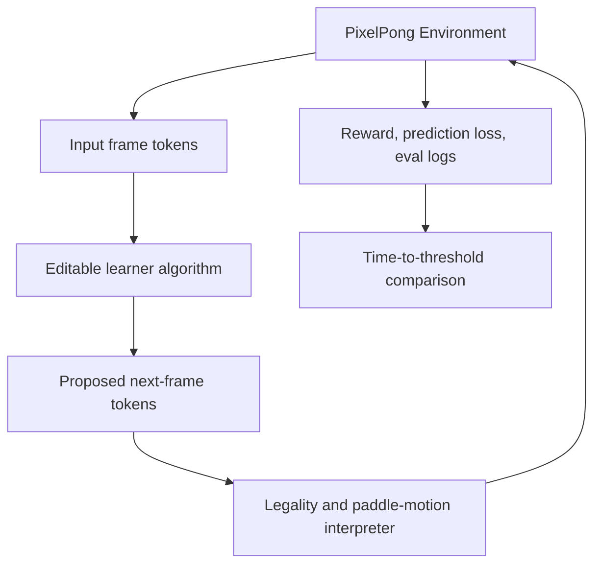

# Benchmark Architecture - Plan

## Goal Capsule

- **Objective:** Define the v1 architecture requirements for Nano Pixel RL before implementation begins.
- **Product authority:** `STRATEGY.md`, especially the speedrun benchmark, editable learner surface, immutable shared token space, and next-pixel prediction thesis.
- **Open blockers:** The exact grid dimensions, reference threshold, and initial baseline runtime must be calibrated during implementation.

---

## Product Contract

### Summary

Nano Pixel RL will be a benchmark-first repo for a PixelPong speedrun where contributors edit only the learner algorithm that transforms input frame tokens into proposed output frame tokens.
The environment, token vocabulary, legality rules, scoring, and leaderboard-valid run contract stay fixed so improvements measure learning dynamics rather than benchmark drift.

### Problem Frame

The project is trying to copy the useful part of nanochat's speedrun culture: a small, understandable repo where many contributors can make algorithmic changes and compare wall-clock progress against the same target.
For this to work in RL, the benchmark must prevent contributors from winning by changing the environment, action space, reward definition, data plumbing, or evaluation harness.
The shared token space is the core scaling bet: the model sees simple image-grid tokens and proposes the next image-grid tokens, making PixelPong a tiny version of the sequence-modeling problem rather than a discrete-action toy.

### Key Decisions

- **Benchmark-first repo:** The repo exists to run one canonical speedrun, not to provide a general RL framework.
- **Immutable token contract:** The token values and their meanings are fixed for leaderboard-valid runs: `0` is background, `0.5` is ball, and `1` is paddle.
- **Shared input/output token space:** Observations and proposals use the same grid vocabulary, so the learner's job is to transform input tokens into output tokens.
- **Algorithm-only competition surface:** Valid benchmark submissions may change learner internals, model architecture, loss weighting, optimization, memory, and update rules, but not the token vocabulary, environment rules, reward contract, or evaluator.
- **Next-pixel prediction is central:** Dense frame prediction loss is part of the benchmark thesis, not a debugging metric.



### Actors

- A1. **Benchmark contributor:** Edits the learner algorithm and runs the canonical speedrun to reduce time-to-threshold.
- A2. **Benchmark maintainer:** Protects the environment contract, threshold, leaderboard rules, and reference run quality.
- A3. **Future planner or agent:** Reads this plan to produce an implementation plan without inventing benchmark behavior.

### Requirements

**Benchmark contract**

- R1. The repo must define one canonical PixelPong benchmark with stable environment rules, reward components, evaluation rollouts, and leaderboard-valid run output.
- R2. The shared token vocabulary must be immutable for leaderboard-valid runs: `0` means background, `0.5` means ball, and `1` means paddle.
- R3. The observation and action proposal must use the same grid token space, with the learner proposing an entire next frame rather than a discrete UP/DOWN action.
- R4. The environment must interpret coherent paddle movement from the proposed frame and reject impossible edits without allowing the learner to bypass physics through direct state edits.
- R5. The reward contract must include a large point-winning signal and a smaller dense next-pixel prediction signal.
- R6. The benchmark must separate controllable and uncontrollable dynamics: one paddle is influenceable through legal proposals, the ball follows physics, and the opponent paddle is not directly controlled by the learner.

**Contributor surface**

- R7. The repo must make the intended editable surface obvious: contributors change learner algorithm code that maps input tokens to output tokens.
- R8. The repo must document which surfaces are frozen for leaderboard-valid work, including token vocabulary, environment transition rules, legality checks, reward definitions, evaluator, and speedrun command semantics.
- R9. The learner surface must support algorithm-level experimentation, including model shape, optimizer, memory/state, auxiliary losses, batching, and update logic.
- R10. The learner surface must not require contributors to understand or modify backend environment plumbing for normal experimentation.

**Speedrun and leaderboard**

- R11. The repo must provide a canonical speedrun command that trains, evaluates, records wall-clock time, and emits a submission-ready result artifact.
- R12. The leaderboard metric must be time-to-threshold, where the threshold is based on PixelPong point performance and valid run checks rather than prediction loss alone.
- R13. Run artifacts must include enough metadata to audit validity, including code revision, seed settings, hardware summary, elapsed time, threshold result, invalid proposal rate, and prediction loss.
- R14. The reference run should initially target roughly one hour to threshold, with the expectation that contributors optimize it downward over time.

**Repo shape**

- R15. The repo should separate frozen benchmark code from editable learner code in names and documentation, so contributors can tell what is fair game.
- R16. The repo should include a small reference learner that is simple enough to modify and slow enough to leave room for speedrun improvements.
- R17. The repo should include docs that explain the shared-token thesis, leaderboard rules, validity rules, and the shortest path from clone to first speedrun.
- R18. The repo should include tests or validation checks that catch accidental changes to token meanings, environment dynamics, reward shape, and evaluator behavior.

### Proposed Repo Design

The exact file names may change during planning, but the repo should preserve this separation of responsibilities.

```text
nano-pixel-rl/
  README.md
  STRATEGY.md
  docs/
    leaderboard.md
    benchmark-contract.md
    learner-guide.md
    plans/
  nano_pixel_rl/
    env/
      pixelpong.py
      tokens.py
      interpreter.py
      rewards.py
    benchmark/
      speedrun.py
      evaluate.py
      validate_run.py
      logging.py
    learner/
      learner.py
      model.py
      update.py
    reference/
      config.py
      baseline.py
  runs/
    speedrun.sh
  tests/
    test_tokens.py
    test_pixelpong_dynamics.py
    test_interpreter_legality.py
    test_reward_contract.py
    test_run_validation.py
```

### Key Flows

- F1. **First local speedrun**
  - **Trigger:** A contributor clones the repo and wants a baseline result.
  - **Actors:** A1.
  - **Steps:** Install dependencies, run the canonical speedrun command, train the reference learner, evaluate against the threshold, and inspect the emitted run artifact.
  - **Outcome:** The contributor has a valid baseline time and knows where to edit learner logic.

- F2. **Learner experiment loop**
  - **Trigger:** A contributor wants to improve benchmark speed.
  - **Actors:** A1.
  - **Steps:** Edit learner algorithm code, run a smoke check, run the speedrun, compare time-to-threshold and validity metrics against the baseline.
  - **Outcome:** The contributor can tell whether the algorithm improved speed without changing the benchmark contract.

- F3. **Maintainer validity review**
  - **Trigger:** A result is proposed for the leaderboard.
  - **Actors:** A2.
  - **Steps:** Check run artifact metadata, confirm frozen surfaces were not changed, verify threshold was reached, and compare reported metrics.
  - **Outcome:** The maintainer can accept or reject the run without reverse-engineering the experiment.

### Acceptance Examples

- AE1. **Covers R2, R3, R8.**
  - **Given:** A contributor changes the meaning of token `0.5` from ball to something else.
  - **When:** The run is validated for leaderboard eligibility.
  - **Then:** The run is rejected because the token vocabulary is immutable.

- AE2. **Covers R4, R6.**
  - **Given:** The learner proposes a frame that teleports the ball or directly edits the opponent paddle.
  - **When:** The environment interpreter processes the proposal.
  - **Then:** The impossible edit is rejected or ignored according to the fixed legality contract.

- AE3. **Covers R5, R12.**
  - **Given:** A learner achieves low next-pixel prediction loss but cannot win points.
  - **When:** The speedrun evaluates threshold completion.
  - **Then:** The run does not qualify because point performance is the main threshold signal.

- AE4. **Covers R7, R9, R10.**
  - **Given:** A contributor changes model architecture and update logic inside the learner surface.
  - **When:** The speedrun validates the run.
  - **Then:** The run remains eligible if frozen benchmark surfaces are unchanged.

### Success Criteria

- The first implementation plan can proceed without inventing the environment/learner boundary.
- A new contributor can identify the editable learner surface in under five minutes from the README.
- A speedrun result can be audited from its emitted artifact without reading the whole codebase.
- Tests or validators fail when token meanings, reward components, evaluator semantics, or legality rules change unexpectedly.
- The reference run is slow enough to invite optimization and fast enough to iterate locally.

### Scope Boundaries

**Deferred for later**

- Multiple environments beyond PixelPong.
- A polished web dashboard for leaderboard browsing.
- Rich visualization tools beyond minimal debugging output.
- Distributed training support.

**Outside this product's identity**

- A general Gym-compatible RL framework as the main interface.
- Leaderboard-valid submissions that alter token meanings, environment physics, reward definitions, or evaluator thresholds.
- Discrete action-head competition as the core benchmark shape.

### Dependencies / Assumptions

- Python is the default implementation language unless planning finds a strong reason to choose otherwise.
- The exact threshold must be calibrated after a working reference learner exists.
- The initial one-hour target is a product goal, not yet an empirical measurement.
- Leaderboard validity depends on social rules and repository checks; v1 does not need tamper-proof remote attestation.

### Outstanding Questions

**Deferred to planning**

- What initial grid size, paddle size, and episode length should v1 use?
- What minimum local hardware target should define the reference one-hour run?
- Whether the canonical command should be shell-first, Python CLI-first, or both.
- Whether run artifacts should be JSON only or include a small markdown summary.
- How strict validation should be for changes outside the learner surface in non-leaderboard local experiments.

### Sources / Research

- `STRATEGY.md` defines the product thesis, primary users, metrics, and active tracks.
